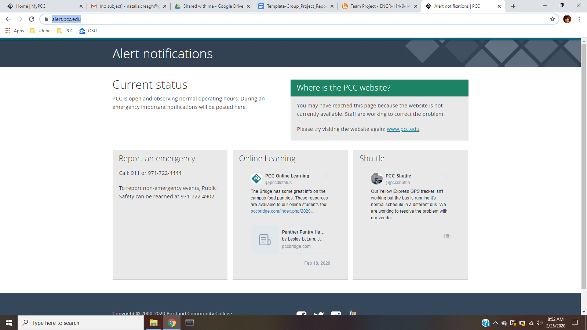
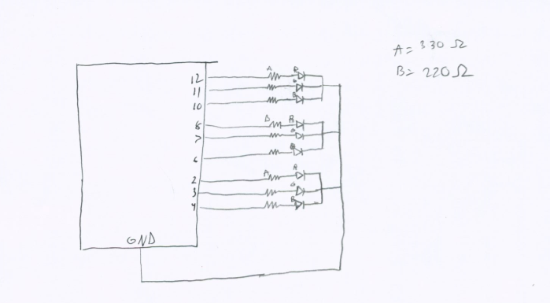
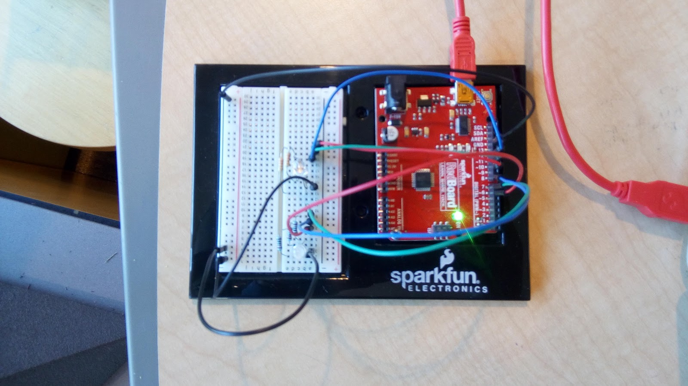
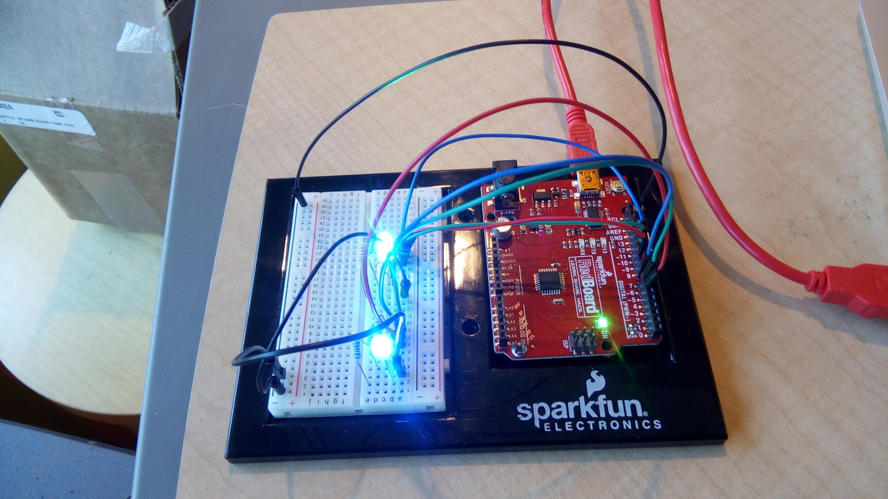

Authors: Jackie Armour, Natalia Creagh, Daniel Maestas

Course: ENGR114 Winter 2020

# Arduino Predicts Impending Disaster

## Problem Statement:

Our group was tasked with web scraping the PCC Alert Page to find alerts and present the alert in the form of an LED’s color change.




## Hardware Setup:
### Bill of Materials
| Part Name | Purpose | Item Name | URL | Price |
|----|----|----|----|----|
| DEV-13975	| Takes code and installs it into breadboard | SparkFun RedBoard - Programmed with Arduino | https://www.sparkfun.com/products/13975 | $19.95 |
| DEV-11235 | Holds Arduino and Breadboard | Arduino and Breadboard Holder | https://www.sparkfun.com/products/11235 | $3.95 |
| CAB-11301 | Connects computer to RedBoard | SparkFun USB Mini-B Cable - 6 Foot | https://www.sparkfun.com/products/11301 | $3.95 |
| COM-12062 | Indicate alerts | LED - Assorted (20 pack) | https://www.sparkfun.com/products/12062 | $2.95 |
| COM-11507 | Reduces current flow | Resistor 330 Ohm 1/6 Watt PTH - 20 pack | https://www.sparkfun.com/products/11507 | $0.95 |
| COM-11508 | Reduces current flow | Resistor 10K Ohm 1/6th Watt PTH - 20 pack | https://www.sparkfun.com/products/11508 | $0.95 |

### Hardware Schematic



### Hookup Guide
| Part | Pin | Connector | Pin | Part |
|----|----|----|----|----|
| Redboard | GRND | Black Wire | - | Breadboard |
| Redboard | 12 | Blue Wire | a28 | Breadboard |
| Redboard | 11 | Green Wire | a29 | Breadboard |
| Redboard | 10 | Red Wire | a30 | Breadboard |
| Redboard | 8 | Blue Wire | a8 | Breadboard |
| Redboard | 7 | Green Wire | a9 | Breadboard |
| Redboard | 6 | Red Wire | a7 | Breadboard |
| Redboard | a3 | Black Wire | - | Breadboard |
| Redboard | a25 | Black Wire | - | Breadboard |
| Breadboard | b2 | White LED | b3,b4,b5 | Breadboard |
| Breadboard | c5 | Resistor | c9 | Breadboard |
| Breadboard | d4 | Resistor | d8 | Breadboard |
| Breadboard | e2 | Resistor | e7 | Breadboard |
| Breadboard | a24 | White LED | b25,b26,b27 | Breadboard |
| Breadboard | c27 | Resistor | c30 | Breadboard |
| Breadboard | d26 | Resistor | d29 | Breadboard |
| Breadboard | e24 | Resistor | e28 | Breadboard |

### Image of hardware all connected:



## Code:
### Python Code
[usr_functions.py](PythonCode/FinalCode/usr_functions.py)

```python
# all user defined functions needed to run the program are here to keep the program file that communicates with the Arduino neat and consise.
import requests
from bs4 import BeautifulSoup
import pyfirmata


# webscraper, grabs webpage and finds desired alert text
def scrape(url):
    
    try:
        page = requests.get(url)
    
        if page.status_code==200:
            pageStatus = "Page Accessed!"
            soup = BeautifulSoup(page.content, 'html.parser')
            tags = [str(tag) for tag in soup.find_all()]
            for i,content in enumerate(tags):
                if ("h3" in content.lower()):
                    while not('div' in tags[i]):
                        statusTag = tags[i]
                        if not('statusText' in locals()):
                            statusText = statusTag.split('>')[1].split('<')[0]
                        else:
                            statusText = statusText+" "+statusTag.split('>')[1].split('<')[0]
                        i += 1
            if not('statusText' in locals()):
                statusText = "Status Header not found"
        else:
            pageStatus = f"Error code: {page.status_code}, page not accessible"
            statusText = "Page was not accessed, no text retrieved"
    except Exception as e:
        pageStatus = "Connection to page failed. Error: "+repr(e)
        statusText = "Page was not accessed, no text retrieved"
    finally:
        print(pageStatus)
        print(statusText)
        return pageStatus, statusText


# processing of data to check and interpret status
def status_check(para):
    
    paragraph = para.lower() # it is converted to all lower case since there are some random capitalizations 
    
    campuses = {'pcc':'red','centers':'red', 'campuses':'red', 'cascade':'blue', ' ca ':'blue', 'sylvania':'green', ' sy ':'green', ' syl ':'green', 'south east':'yellow', ' se ':'yellow', 'rock creek':'purple', ' rc ':'purple'}
    # This is the dictionary used for campuses. Each campus has a correspodning color that tells the LED which color it should shine.
    for i in campuses:  
        # i goes through the dictionary and see if it matches any words from the paragraph
        if i in paragraph:
            campus_status = campuses[i]
            # Once it finds a match, colour is assigned the keyword which will be the color for the LED.
    if not('campus_status' in locals()):
        campus_status = "white"
    print(campus_status)
    

    alert = {'It is now safe to resume normal activities':'green','open and observing normal operating hours':'green','restored':'green','outage':'cyan','emergency':'red','emergencies':'red','seek shelter':'red','evacuation':'red','evacuate':'red','evacuated':'red','evacuating':'red','drill':'purple','closed':'yellow','close':'yellow','closing':'yellow','closure':'yellow','cancel':'yellow','cancelled':'yellow','during an emergency':'green'}
    for i in alert:
        if i in paragraph:
            alert_status = alert[i]
        elif 'not a drill' in paragraph:
            alert_status = 'red'
            # this line of code is used to differentiate the line 'not a drill' and 'drill'.
    if not('alert_status' in locals()):
        alert_status = "white"
    print(alert_status)
    
    
    weather = {'wind':'green','winds':'green', 'storm':'purple','storms':'purple','lighting':'yellow','thunder':'yellow','snow':'blue','snowfall':'blue','ice':'blue','icy':'blue','earthquake':'cyan','earthquakes':'cyan','fire':'red','fires':'red'}
    for i in weather:    
        if i in paragraph:
            weather_status = weather[i] 
    if not('weather_status' in locals()):
        weather_status = "white"
    print(weather_status)
    
    
    return campus_status, alert_status, weather_status


# rgb LED color control function for ease of use in final program file
def set_led(led,color=[0,0,0]):
    if not('led_list' in globals()):
        global led_list
        led_list = []
    
    if not(led in led_list):
        led_list.append(led)
    
    colorValue = {'red':[255,0,0],'green':[0,255,0],'blue':[0,0,255],'yellow':[255,255,0],'cyan':[0,255,255],'purple':[255,0,255],'white':[255,255,255]}
    
    for LED_name in globals():
            if globals()[LED_name]==led:
                thisLED = LED_name
                break
            else:
                continue
    
    if type(color)==str:
        try:
            rgb_list = colorValue[color]
        except KeyError:
            print("Invalid color name \""+color+"\" for "+thisLED)
            rgb_list = [255,255,255]
    
    elif type(color)==list:
        rgb_list = color
        place = ['Red','Green','Blue']
        for index, value in enumerate(rgb_list):
            if (value>255) or (value<0):
                print(place[index]+" color value \""+str(rgb_list[index])+"\" is out of range (0 to 255) for "+thisLED)
                rgb_list = [255,255,255]
            else:
                continue
        
    else:
        print("Invalid color format \""+str(type(color)).split('\'')[1]+"\" for "+thisLED)
        rgb_list = [255,255,255]
    
    led[0].write(rgb_list[0]/255)
    led[1].write(rgb_list[1]/255)
    led[2].write(rgb_list[2]/255)

```

### Arduino Code
[MasterProgram.py](PythonCode/FinalCode/MasterProgram.py)

```python
# import the necessary libraries
import pyfirmata
from time import sleep

# import the user-defined function files
import usr_functions

# tell the program what website to scrape from
url_to_check = 'https://jackiearmour.github.io/PCCAlertsWebscraper/' #'https://alert.pcc.edu/' 'https://jackiearmour.github.io/PCCAlertsWebscraper/'

# store the name of the USB port the Arduino is connected to
portName = '/dev/cu.usbserial-DN02SJR4'

# create the board object in Python
board = pyfirmata.Arduino(portName)

# setup the LEDs by storing their locations. d for digital, a for analogue, pin number, o for ouput, i for input, p for pwm
campusLED = [board.get_pin('d:10:o'),board.get_pin('d:11:o'),board.get_pin('d:12:o')]
alertLED = [board.get_pin('d:6:o'),board.get_pin('d:7:o'),board.get_pin('d:8:o')]
weatherLED = [board.get_pin('d:2:o'),board.get_pin('d:3:o'),board.get_pin('d:4:o')]


try:
    while True:
        # scrape the webpage
        page_status, status_text = usr_functions.scrape(url_to_check)
        
        # makes sure the webpage was reached before attempting to proccess the alert text
        if page_status=="Page Accessed!":
            campus_status, alert_status, weather_status = usr_functions.status_check(status_text) # processes the alert text
        else: # if page was not reached, set all LEDs to white
            print("No status to process")
            campus_status = 'white'
            alert_status = 'white'
            weather_status = 'white'
        
        # set the LEDs to the determined colors
        usr_functions.set_led(campusLED,campus_status)
        usr_functions.set_led(alertLED,alert_status)
        usr_functions.set_led(weatherLED,weather_status)

        # pause here for 30 seconds before checking again
        sleep(30)
        
except KeyboardInterrupt:
    print(usr_functions.led_list)
    for LED in usr_functions.led_list:
        usr_functions.set_led(LED)
    print('Program stopped by user')
    raise

```

## Results:
The code results in three files with massive functions feeding into one compact file. The arduino code enables the LEDs to light up according to the alert assigned to a color.



## Future Work:

What could another group of students do to build on this project? Any resources this group could use to build this future work?

A future group of students could add more LEDs/colors to indicate a wider range of alerts. This would require a larger or multiple redboards because more pins are needed to connect the hardware.

## License
MIT License


Copyright (c) 2020 Jackie Armour


Permission is hereby granted, free of charge, to any person obtaining a copy


of this software and associated documentation files (the "Software"), to deal


in the Software without restriction, including without limitation the rights


to use, copy, modify, merge, publish, distribute, sublicense, and/or sell


copies of the Software, and to permit persons to whom the Software is


furnished to do so, subject to the following conditions:


The above copyright notice and this permission notice shall be included in all


copies or substantial portions of the Software.


THE SOFTWARE IS PROVIDED "AS IS", WITHOUT WARRANTY OF ANY KIND, EXPRESS OR


IMPLIED, INCLUDING BUT NOT LIMITED TO THE WARRANTIES OF MERCHANTABILITY,


FITNESS FOR A PARTICULAR PURPOSE AND NONINFRINGEMENT. IN NO EVENT SHALL THE


AUTHORS OR COPYRIGHT HOLDERS BE LIABLE FOR ANY CLAIM, DAMAGES OR OTHER


LIABILITY, WHETHER IN AN ACTION OF CONTRACT, TORT OR OTHERWISE, ARISING FROM,


OUT OF OR IN CONNECTION WITH THE SOFTWARE OR THE USE OR OTHER DEALINGS IN THE


SOFTWARE.

